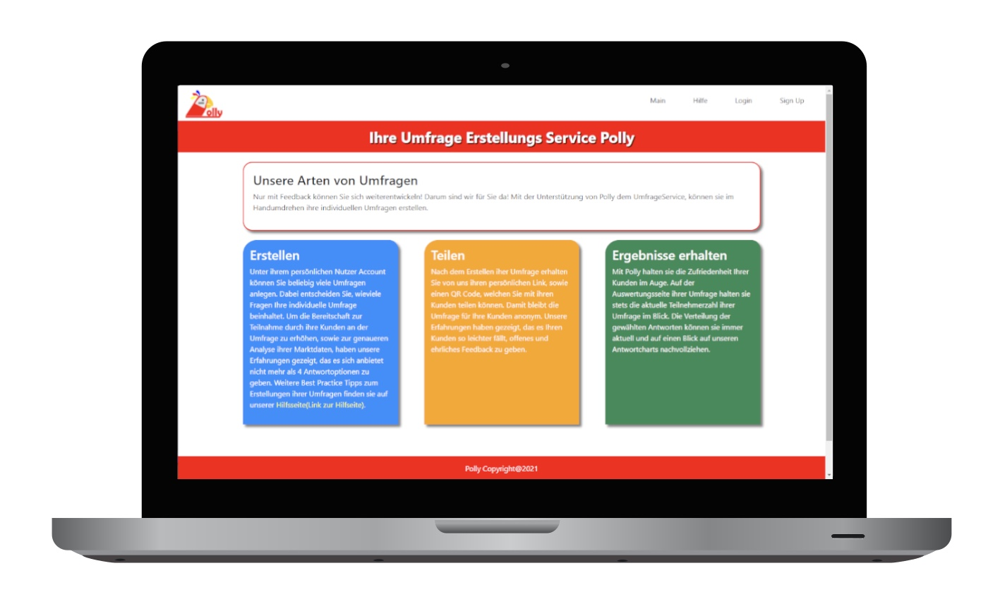
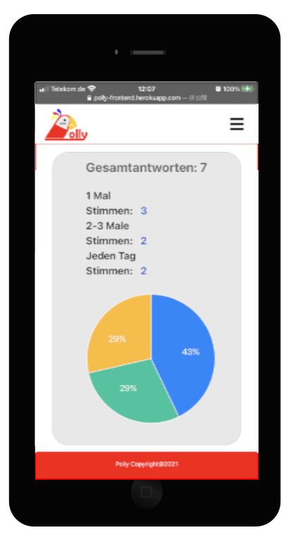

<!-- Used for the "back to top" links within the document -->
<div id="contents"></div>

#  Polly Umfrageservice 


## Über uns

- Sie mögen kein Stillstand, sondern wollen sich stetig weiter entwickeln?
- Kein Problem, wir sind für Sie da!

## Wie funktioniert es?

#### Umfrageersteller:

- Nutzerprofil anlegen
- danach können Sie ihre individuellen Umfragen anlegen (dabei bestimmen Sie, die Anzahl der Fragen und Antwortoptionen) - wir helfen Ihnen mit unseren Best Practice Tipps zur Umfrageerstellung
- nach dem Anlegen der Umfrage bekommen Sie von uns ihren individuellen Umfragelink, sowie QR Code, welchen Sie an ihren Kunden zur Abstimmung weiterleiten können
- unter ihrem persönlichen Nutzerprofil können Sie jederzeit die Auswertung der Umfrage, sowie die Anzahl der Umfrageteilnehmer auf unseren Antwortcharts in Echtzeit abfragen

#### Umfrageteilnehmer:

- der Umfrageteilnehmer bekommt seinen individuellen Link oder QR Code vom Umfrageersteller zugesendet, durch welchen er Zugang zur Umfrage erhält

## Benefits

- stetige Verbesserung bzw. Anpassung des Angebots


## Tech Stack

- Frontend: React | Reactstrap | Recharts
- Backend: Express | MongoDB | Mongoose | Node | JWT |
- Tools: Git | Visual Studio Code | Postman


<p align="left">

&nbsp;

&nbsp;

&nbsp;


&nbsp;

&nbsp;

&nbsp;

&nbsp;

&nbsp;

&nbsp;

&nbsp;

&nbsp;

&nbsp;


&nbsp;

&nbsp;

&nbsp;

&nbsp;

&nbsp;
</p>


## Preview

[Live Demo](https://polly-frontend.herokuapp.com/)
</br>
<p>


</p>

## Setup
### Frontend
[Link GitHub Backend](https://github.com/Tobeadragon/Polly_Backend)


1. ```
   clone repository
   ```
2. ```
   cd <your-repository-name>
   npm install
   ```
3. ```
   npm start
   ```
4. ```
   Enjoy
    ```

### Backend
[Link GitHub Frontend](https://github.com/Tobeadragon/Polly_Frontend)

1. ```
   clone repository
   ```
2. ```
   cd <your-repository-name>
   npm install
   ```
3. ```
   create .env with clientID, clientSecret (<- Google Login), mongo (<- mongodb connection), JWT
4. ```
   npm run watch

    ```
4. ```
   Enjoy
    ```

### Future Features

- language api - App in verschiedenen Sprachen nutzbar machen
- Barrierefreiheit
- Datum hinzufügen, wann die Umfrage angelegt wurde
- Auswertung der Antworten über Zeiträume

<sub>[⇧ back to top](#contents)</sub>

Made with ❤️ and JavaScript by

- [Tatsuya](https://github.com/Tobeadragon)
- [Fatih](https://github.com/Fatihh53)
- [Elham](https://github.com/elhamhashemi56)
- [Mandy](https://github.com/MandyNeumeyer)


